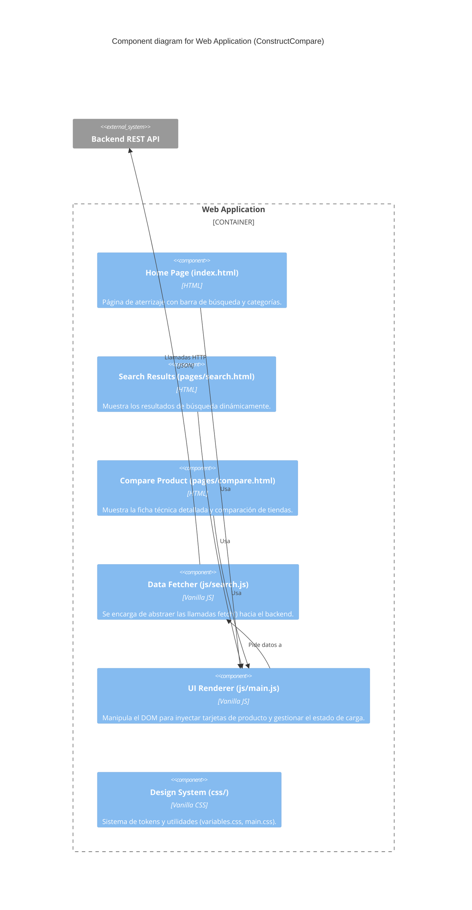

# C4 Component-Level Documentation (Frontend)

## 1. Component Diagram (Web Application)

```mermaid
C4Component
    title Component diagram for Web Application (ConstructCompare)

    Container_Boundary(spa, "Web Application") {
        Component(home, "Home Page (index.html)", "HTML", "Página de aterrizaje con barra de búsqueda y categorías.")
        Component(search_page, "Search Results (pages/search.html)", "HTML", "Muestra los resultados de búsqueda dinámicamente.")
        Component(compare_page, "Compare Product (pages/compare.html)", "HTML", "Muestra la ficha técnica detallada y comparación de tiendas.")
        
        Component(api_service, "Data Fetcher (js/search.js)", "Vanilla JS", "Se encarga de abstraer las llamadas fetch() hacia el backend.")
        Component(ui_renderer, "UI Renderer (js/main.js)", "Vanilla JS", "Manipula el DOM para inyectar tarjetas de producto y gestionar el estado de carga.")
        
        Component(css, "Design System (css/)", "Vanilla CSS", "Sistema de tokens y utilidades (variables.css, main.css).")
    }

    System_Ext(api, "Backend REST API")

    Rel(home, ui_renderer, "Usa")
    Rel(search_page, ui_renderer, "Usa")
    Rel(compare_page, ui_renderer, "Usa")

    Rel(ui_renderer, api_service, "Pide datos a")
    Rel(api_service, api, "Llamadas HTTP", "JSON")
```
