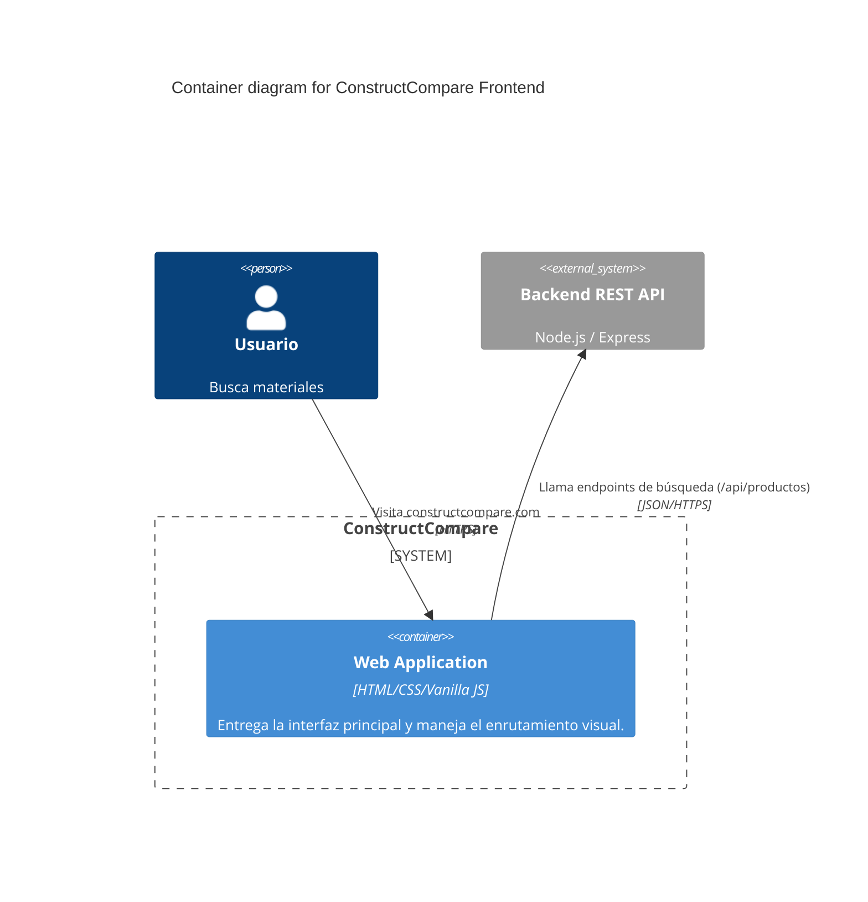

# C4 Container-Level Documentation (Frontend)

## 1. Containers
- **Name:** Single Page Web Application
  - **Type:** Web Browser Application
  - **Technology:** HTML5, CSS3, Vanilla JavaScript ES6
  - **Deployment:** Servidor de archivos estáticos (Nginx, Vercel, etc.)
  - **Description:** Entrega todo el contenido estático y lógica de cliente (Vanilla JS) al navegador del usuario, que a su vez consume la API REST del backend.

## 2. Container Diagram

