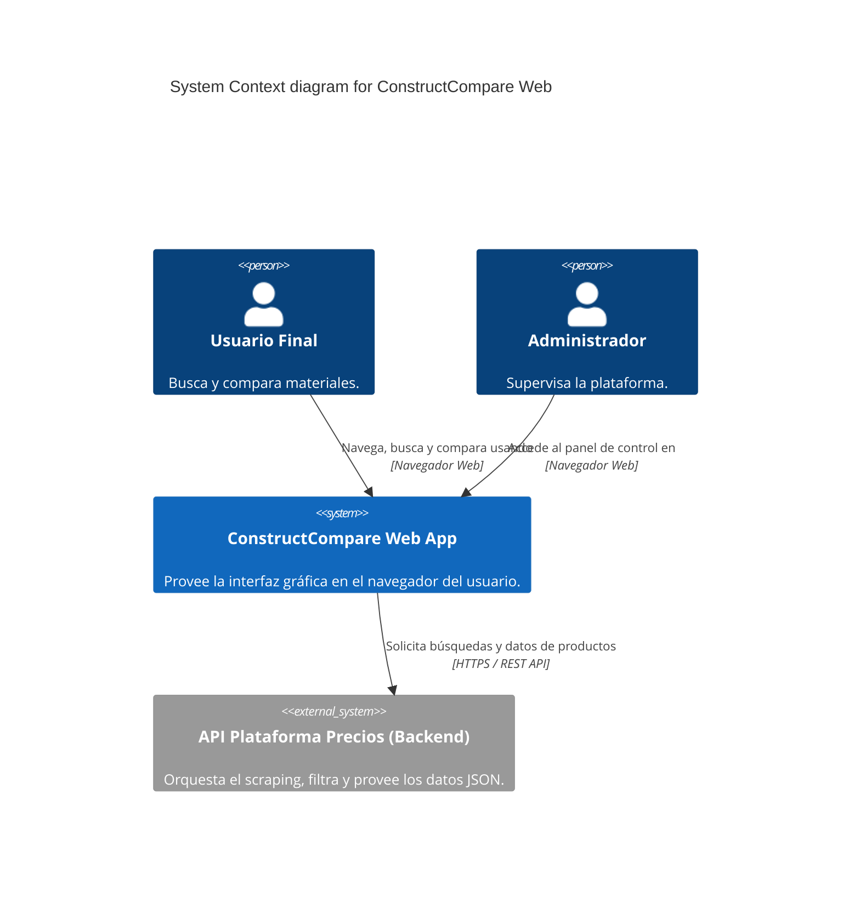

# C4 Context-Level Documentation (Frontend)

## 1. System Overview
**Name:** ConstructCompare Web App
**Short Description:** Interfaz de usuario para la Plataforma de Precios de Materiales de Construcción.
**Long Description:** Aplicación web estática que actúa como el punto de entrada principal para los usuarios finales (cotizadores, constructores). Les permite interactuar con el sistema, buscar productos, y ver cuadros comparativos de precios extraídos de múltiples tiendas minoristas.

## 2. Personas
- **Usuario Final (Cotizador/Constructor):**
  - **Type:** Human User
  - **Description:** Profesional o persona natural buscando optimizar costos de materiales.
  - **Goals:** Buscar materiales, comparar precios, y ser redirigido a la tienda más económica.
  - **Key features used:** Búsqueda, Vista de Resultados, Tabla Comparativa.

- **Administrador:**
  - **Type:** Human User
  - **Description:** Gestor de la plataforma.
  - **Goals:** Visualizar analíticas y monitorear la salud del motor de scraping.
  - **Key features used:** Panel de Dashboard / Admin.

## 3. System Features
- **Exploración de Catálogo:** Búsqueda por texto libre y exploración mediante categorías.
- **Visualización Comparativa:** Tarjetas de productos que muestran el rango de precios en el mercado.
- **Integración API en vivo:** Consultas asíncronas al Backend para traer información en tiempo real.

## 4. System Context Diagram

